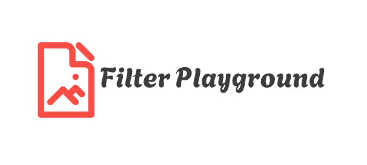
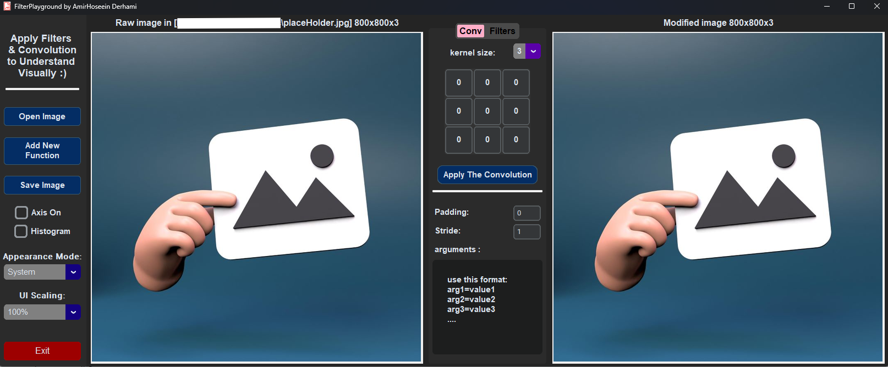
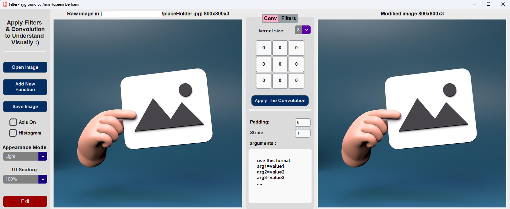

# FilterPlayground



<strong>Filter Playground is an interactive GUI application for studying and experimenting
with filters and convolution techniques in image processing. The application provides
a user-friendly interface for exploring various filters, convolution operations,
and their effects on images. Users can visualize the results in real-time and gain insights into the fundamentals of
image processing.<br>
For run the GUI follow the instructions, please refer to [Run the GUI](#run-the-gui).
</strong>

## Key Features:

<strong>
- Interactive GUI for studying filters and convolution
- Supports exploration of various filter types and configurations
- Real-time visualization of filter effects on images
- Educational tool for learning image processing concepts
- Cross-platform compatibility (Windows, macOS)
 </strong>

## overview

**This section provides a screenshot of the GUI**.

- ### dark mode



- ### light mode



## Run the GUI

### 1. Clone the repository:

```bash
git clone https://github.com/AmirHDevo/FilterPlayground.git
``` 

### 2. Navigate to the project directory:

```bash 
cd FilterPlayground
```

### 3.Install the required dependencies using pip:

```
pip install -r requirements.txt
```

### 4. run app

```bash 
python app.py
```

#### or

```bash
py app.py
```

